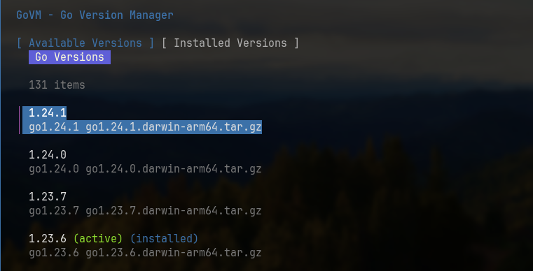

# GoVM - Go Version Manager

GoVM is a modern tool for managing multiple Go versions on your system. It features both a clean Terminal UI (TUI) and a command-line interface for easy installation and switching between Go versions.

## Features

- Beautiful TUI built with [Charm Bubbletea](https://github.com/charmbracelet/bubbletea)
- Command-line interface for quick operations
- Install any available Go version directly from go.dev
- Switch between installed versions with a single command
- Supports partial version numbers (e.g., `1.21` for latest 1.21.x)
- Works on macOS and Linux. Looking for testing for Windows

## Installation

### Prerequisites

- Go 1.18 or higher

### Install

```bash
go install github.com/melkeydev/govm@latest
```

Then in a new terminal run:

```bash
govm
```

To launch the TUI

## First-Time Setup

When you first run GoVM, it will guide you through adding the required directory to your PATH. This is a one-time setup that enables GoVM to manage your Go versions.

### On Linux/macOS

Add this to your shell configuration file (~/.bashrc, ~/.zshrc, etc.):

```bash
export PATH="$HOME/.govm/shim:$PATH"
```

Or run this command to add it automatically:

```bash
echo 'export PATH="$HOME/.govm/shim:$PATH"' >> ~/.bashrc  # or ~/.zshrc
```

Then reload your shell configuration:

```bash
source ~/.bashrc  # or whichever file you modified
```

### On Windows

Add the shim directory to your PATH:

```cmd
setx PATH "%USERPROFILE%\.govm\shim;%PATH%"
```

Then restart your terminal.

## Usage

GoVM can be used in two ways: via the interactive TUI or through command-line commands.

### Terminal User Interface (TUI)

Launch the interactive TUI by running govm without arguments:

```bash
govm
```

#### Navigation

- Use the arrow keys to navigate through the list of versions
- Press `i` to install the selected version
- Press `u` to use/switch to the selected version
- Press `r` to refresh the list of available versions
- Press `Tab` to switch between "Available Versions" and "Installed Versions" views
- Press `q` to quit

### Command Line Interface

```bash
# Install a Go version (latest patch for the specified version)
govm install 1.21  # Installs the latest Go 1.21.x

# Switch to a Go version
govm use 1.20      # Switches to the latest installed Go 1.20.x

# List installed versions
govm list

# Show help
govm help

# Launch the TUI
govm
```

## How It Works

GoVM downloads Go versions from the official go.dev website and installs them in `~/.govm/versions`. It uses a "shim" approach:

- It creates wrapper scripts in `~/.govm/shim` that point to the selected Go version
- When you run `go` or other Go commands, these wrappers execute the proper version
- Switching versions simply updates these wrappers to point to a different installation

This ensures a seamless experience without needing to manually update environment variables or source scripts each time you switch versions.

### Install from source

```bash
# Clone the repository
git clone https://github.com/melkeydev/govm.git
cd govm

# Build and install
go build -o govm
```

Then place the binary somewhere in your PATH.

## Dependencies

- [Charm Bubbletea](https://github.com/charmbracelet/bubbletea) - Terminal UI framework
- [Charm Bubbles](https://github.com/charmbracelet/bubbles) - UI components
- [Lipgloss](https://github.com/charmbracelet/lipgloss) - UI styling
